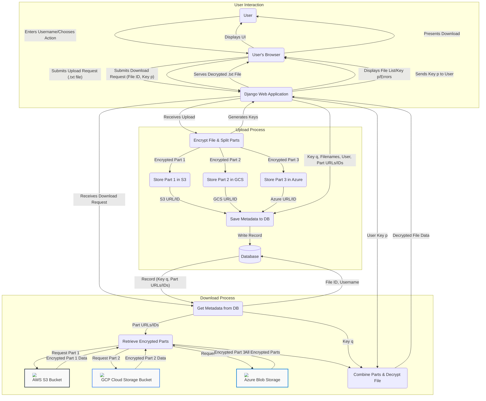

# Confidential Cloud Storage

A simple Django web application for securely uploading, storing, and downloading text files (`.txt`). The application uses Rabin's cryptosystem for encryption and splits the encrypted files into three parts for storage.

## Features

* **User Association:** Files are associated with a username (currently based on session input).
* **Secure Upload:** Upload `.txt` files via a web interface.
* **Encryption:** Files are encrypted using Rabin's cryptosystem upon upload.
    * Two keys (primes `p` and `q`) are generated.
    * Key `p` is shown to the user as the "File Key" required for download.
    * Key `q` is stored securely in the database alongside file metadata.
* **File Splitting:** Encrypted files are split into three parts before storage.
* **Storage:** File parts are stored locally on the server's filesystem within the `media/chunks/` directory.
* **Secure Download:** Users can view their uploaded files and download a specific file by providing the correct "File Key" (`p`). The application retrieves the parts, combines them, decrypts using the provided key `p` and the stored key `q`, and serves the original `.txt` file.
* **File Deletion:** Users can delete their uploaded files, which removes the database record and the stored file parts.

## Technology Stack and Architectire Overview

* **Backend:** Python, Django
* **Encryption:** Custom implementation of Rabin's Cryptosystem (requires primes `p, q ≡ 3 mod 4`)
* **Web Server (Deployment):** Gunicorn
* **Reverse Proxy (Deployment):** Nginx
* **Database:** SQLite (default, configurable in `settings.py`)
* **Frontend:** HTML, CSS (basic styling)

## Core Logic

1.  **Upload:**
    * User provides username and selects a `.txt` file.
    * Server generates two large prime numbers `p` and `q` (both congruent to 3 mod 4).
    * The file content is encrypted character by character using Rabin's algorithm ($c = m^2 \mod n$, where $n=pq$).
    * The encrypted file is saved.
    * The encrypted file is split into 3 parts.
    * Metadata (username, original filename, encrypted filename, key `q`, part locations) is saved to the database.
    * Key `p` is displayed to the user.
2.  **Download:**
    * User provides username and selects a file to download.
    * User enters their File Key (`p`).
    * Server retrieves file metadata and stored key `q` from the database using the file ID and username.
    * Server retrieves the 3 file parts from their stored locations.
    * The parts are combined into the complete encrypted file.
    * The encrypted file is decrypted using the user's key `p` and the stored key `q` via the Chinese Remainder Theorem and Rabin's square root properties.
    * The original `.txt` file is served to the user.
